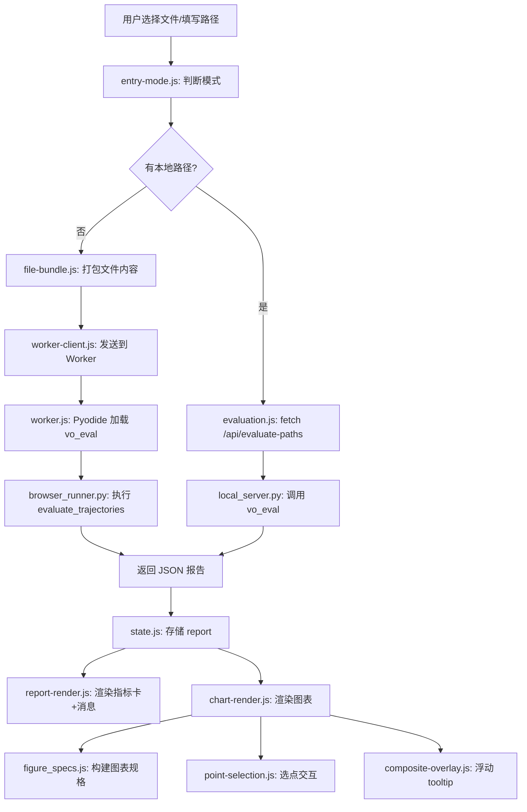
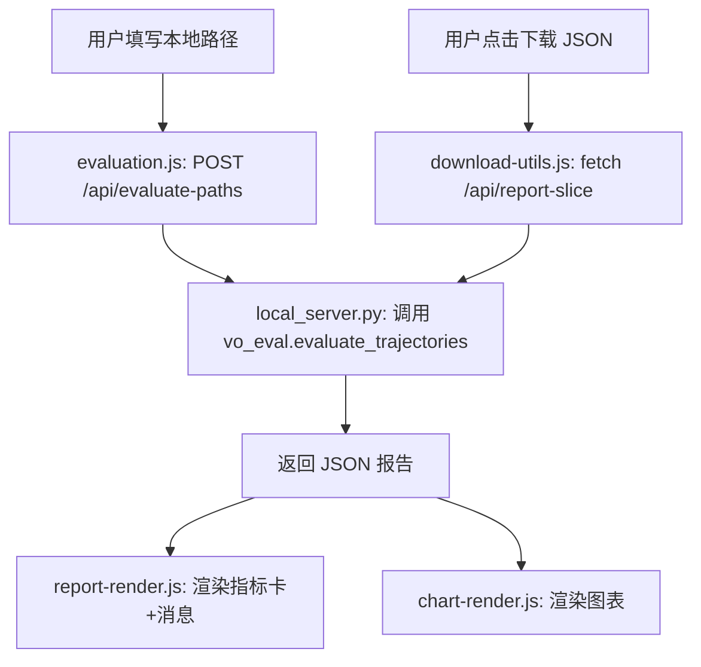
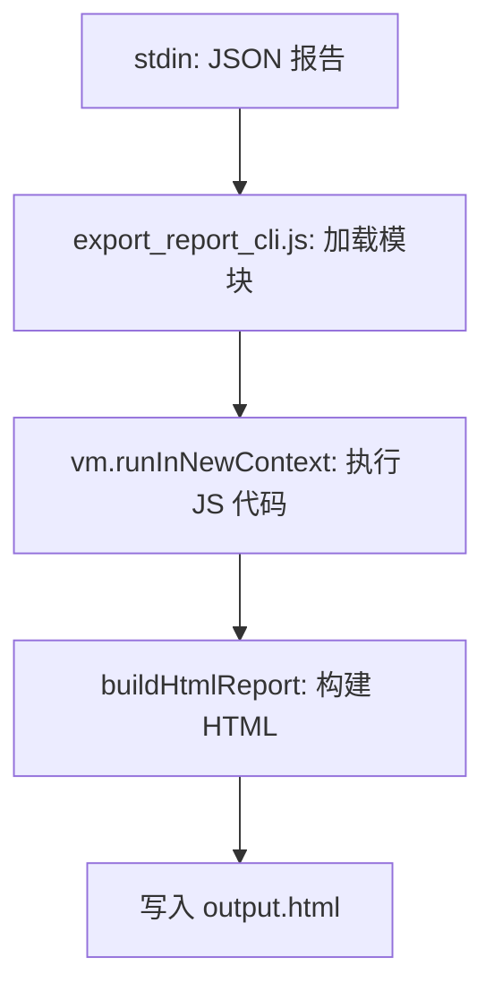

# static_web 模块架构文档

## 模块职责总表

### JS 模块（`js/`）

| 文件 | 导出 | 职责 | 导入 |
|------|------|------|------|
| `main.js` | init, wireEvents | 入口：初始化 + 事件绑定 | state, constants, dom-refs, worker-client, evaluation, entry-mode, file-bundle, report-render, chart-render, point-selection, composite-overlay, html-export, excel-export, download-utils, labels, utils |
| `state.js` | state | 全局状态对象 | constants |
| `constants.js` | chartIds, VLOC/VO_CHART_OPTIONS, POINT_SELECTION_COLORS, PYODIDE_INDEX_URL, PLOTLY_SCRIPT_URL, APP_ASSET_VERSION | 图表ID/标签/颜色常量 | 无 |
| `dom-refs.js` | els | DOM 元素引用缓存 | 无 |
| `worker-client.js` | initPyodide, workerRequest, fetchLocalText, describeRuntimeError | Pyodide Worker 通信 | state, constants, dom-refs, labels |
| `evaluation.js` | runEvaluation, buildConfig, evaluateLocalPathBundle, evaluateSelectedFileBundle, fetchReportSlice | 评估调度 + config 构建 | state, worker-client, dom-refs, file-bundle, entry-mode, report-render, labels |
| `file-bundle.js` | requiredBundleFiles, missingBundleFiles, buildBundlePayload, selectedFiles, directoryFileMap, directoryNameFromFiles, hasLocalPathInputs, updateDirectoryStatus | 文件选择/打包/上传 | dom-refs, utils, labels |
| `entry-mode.js` | reportEntryMode, visibleChartIdsForEntryMode, selectedChartIdsForEntryMode, handleEntryModeChange, updateEntryModeUi, updateRunButton, chartTitleById, clearAllPointSelections 等 | VLOC/VO 模式切换 | state, constants, dom-refs, chart-render, point-selection, report-render, file-bundle, labels, visualization/report_templates |
| `report-render.js` | renderReport, renderMetrics, renderMessages, showMessage, clearMessage, setBusy, enableDownloads | 报告渲染 + UI helpers | state, dom-refs, entry-mode, metrics, point-selection, chart-render, visualization/report_templates, visualization/figure_specs, labels |
| `metrics.js` | metricItems, orientationCorrectionLabel | 指标卡数据构建 | constants, entry-mode, labels |
| `chart-render.js` | scheduleRenderCharts, purgeChart, purgeUnselectedCharts | 图表渲染调度 | state, entry-mode, point-selection, composite-overlay, visualization/figure_specs |
| `point-selection.js` | resetPointSelectionState, ensurePointSelectionTools, clearAllPointSelections, handlePointSelectionKeydown, ExportPointSelection | 选点交互（live + export） | state, constants, dom-refs, entry-mode, labels |
| `composite-overlay.js` | ensureCompositeOverlay, attachCompositeOverlay | Composite 浮动 tooltip | utils, labels |
| `html-export.js` | buildHtmlReport, reportForHtmlExport, downloadHtmlReport | HTML 报告导出 | state, constants, worker-client, point-selection, download-utils, visualization/figure_specs, visualization/report_templates, labels |
| `excel-export.js` | buildTrajectoryWorkbook, downloadTrajectoryExcel | Excel 导出（ZIP/CRC32） | state, download-utils, report-render |
| `download-utils.js` | downloadText, downloadBytes, downloadReportJson, evaluationExportFilename, fetchReportSlice | 下载辅助 + 文件名生成 | state, worker-client, dom-refs, entry-mode, file-bundle, report-render, labels |
| `labels.js` | LABELS | 中文 UI 文案集中管理 | 无 |
| `utils.js` | escapeHtml, escapeXml, formatValue, formatNumber, formatPointNumber, formatOverlayNumber, numbersNearlyEqual, sanitizeFilenamePart, safeJson, cssEscape, valueOf, numberOf | 通用工具函数 | 无 |

### 可视化模块（`visualization/`）

| 文件 | 导出 | 职责 |
|------|------|------|
| `figure_specs.js` | buildVisualizationFigureSpecs, segmentedValues, unwrapDegrees, compositePairColors | 图表规格定义（VLOC/VO 图表数据构建） |
| `report_templates.js` | chartDirectoryHtml, metricGridHtml, metricStatusClass | 报告模板（指标卡 HTML + 图表目录 HTML） |

### Python 模块（`py/`）

| 文件 | 职责 |
|------|------|
| `browser_runner.py` | Pyodide 浏览器内评估适配层，只做 I/O 桥接 |
| `local_server.py` | 本地 HTTP 服务器，提供静态文件 + `/api/evaluate-paths` + `/api/report-slice` 接口 |
| `vo_eval/` (符号链接) | 指向 `../../vo_eval/`，供 worker.js fetch Python 源码 |

### CSS 模块（`css/`）

| 文件 | 职责 | 依赖 |
|------|------|------|
| `style.css` | 运行时 UI 样式（含 CSS 变量定义） | 无 |
| `report-export.css` | 导出 HTML 报告专用样式 | 依赖 `style.css` 的 CSS 变量 |

---

## 数据流图

### 路径 1：浏览器 Pyodide 评估



### 路径 2：本地 HTTP API 评估



### 路径 3：HTML 报告导出

```mermaid
flowchart TD
    A[用户点击"下载 HTML 报告"] --> B[html-export.js: downloadHtmlReport]
    B --> C[fetchLocalText: 获取 Plotly/CSS 源码]
    C --> D[buildHtmlReport: 构建完整 HTML]
    D --> E[figure_specs.js: 生成图表规格 export variant]
    D --> F[report_templates.js: 生成指标卡+目录 HTML]
    D --> G[ExportPointSelection: 内嵌选点交互 JS]
    D --> H[downloadText: 下载 HTML 文件]
    H --> I[离线 HTML: 完全自包含]
```

### 路径 4：CLI 报告生成


